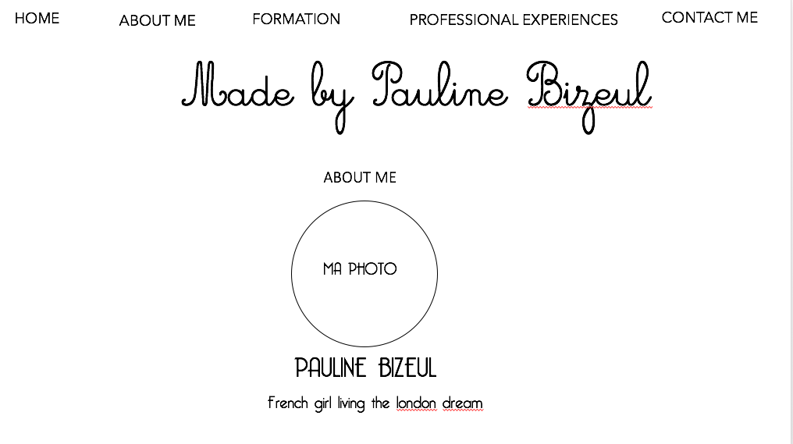
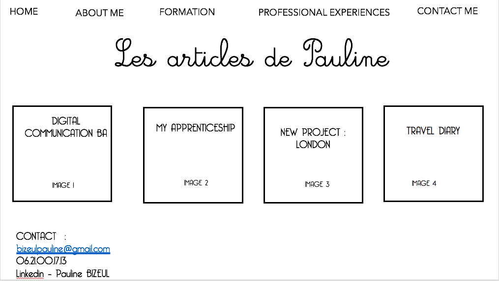
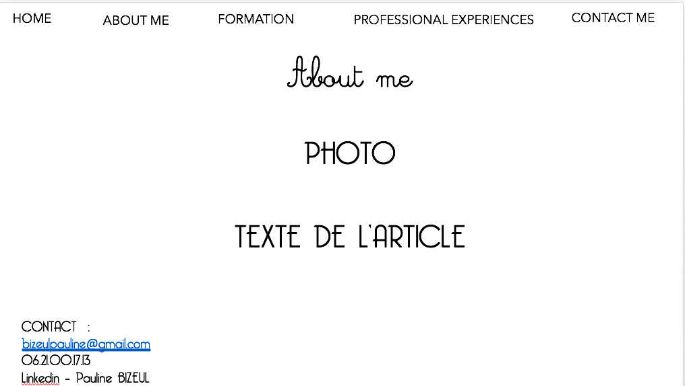
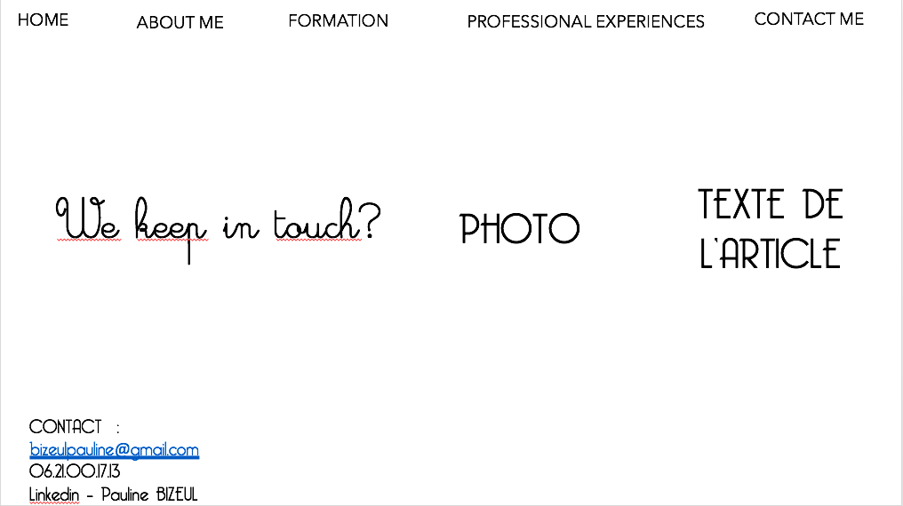
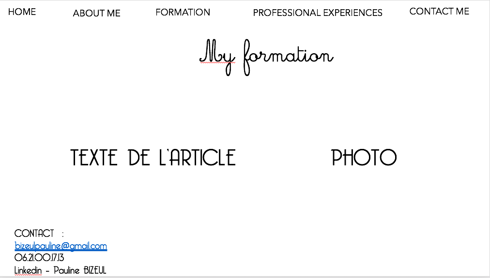

# CV - MADE BY PAULINE BIZEUL 

- Description : 

Mon blog regroupe tout ce qui me concerne : Mon profil, ma formation, mes expériences professionnelles, mes loisirs (voyages, danse).

- CIble :

Mon blog a pour cible des recruteurs en start-up qui pourrait avoir besoin d'une Chargée de communication, afin de leur présenter mon profil ainsi que de leur prouver mes compétences en programmation de site web.

# Construction du site

# Première page : 

- HEADER : avec les différents onglets de mon site : HOME - ABOUT ME - MA FORMATION - MES EXPERIENCES PRO - CONTACTEZ-MOI 

A gauche jusqu'au centre une photo de moi ainsi qu'une courte présentation de mon profil. Des animations sont présentes afin d'animer le texte.





# Deuxième page :
- HEADER : avec les différents onglets de mon site : HOME - ABOUT ME - MA FORMATION - MES EXPERIENCES PRO - CONTACTEZ-MOI 
- FOOTER : Mon contact + onglet LinkedIn pour avoir accès à mon profil LinkedIn. Egalement des Tags des recherches les plus fréquentes.

Des rectangles avec des images en noir et blanc en fonds et mes titres d'articles en blanc.  Les différentes images deviennent couleurs quand on passe ou clique dessus. 

Lorque l'on clique sur un onglet du header, la page se compose ainsi : 



``` 
Page 1 : ABOUT ME
```
- **TITRE**
- image
- Paragraphe
- footer




``` 
Page 2 :  MY FORMATION
```

- **TITRE**
- image
- Paragraphe
- footer



``` 
Page 3 : CONTACT ME
```

- **TITRE**
- image
- Paragraphe
- footer


