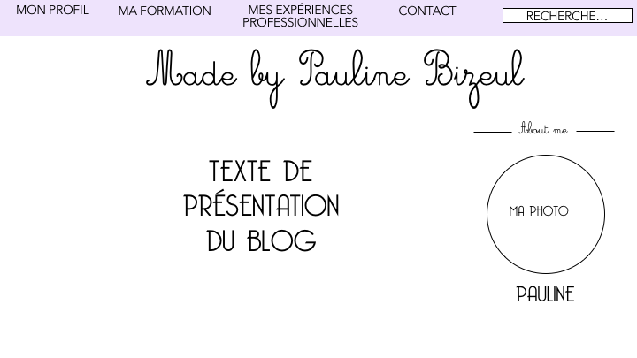
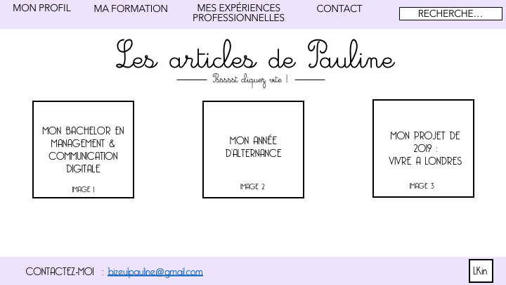
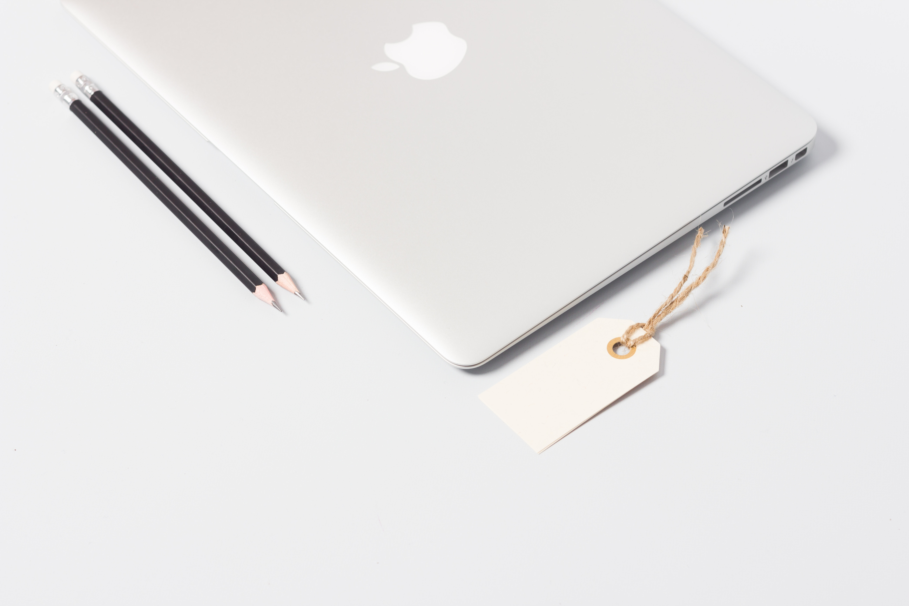
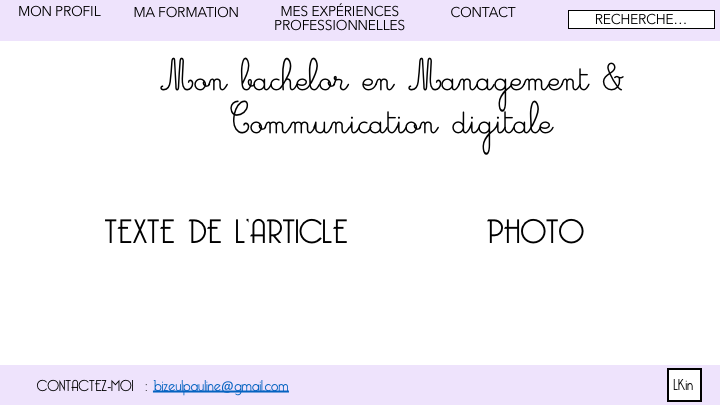
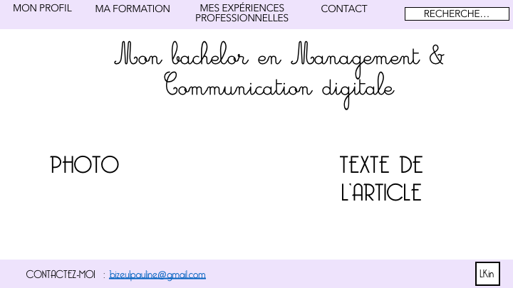
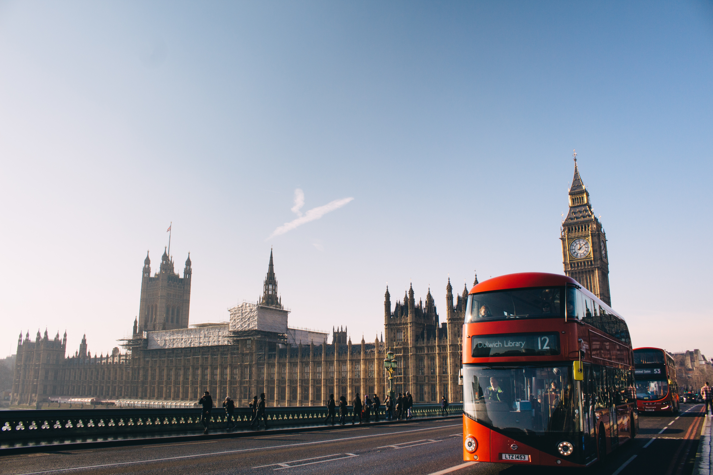
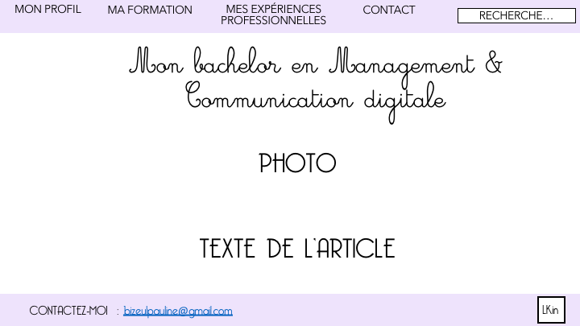

# CV - MADE BY PAULINE BIZEUL 

- Description : 

Mon blog regroupe tout ce qui me concerne : Mon profil, ma formation, mes expériences professionnelles, mes loisirs (voyages, danse).

- CIble :

Mon blog a pour cible des recruteurs en start-up qui pourrait avoir besoin d'une Chargée de communication, afin de leur présenter mon profil ainsi que de leur prouver mes compétences en programmation de site web.

# Construction du site

# Première page : 

- HEADER : avec les différents onglets de mon site : MA FORMATION - MES EXPERIENCES PRO - MON PROFIL - CONTACTEZ-MOI - Ainsi qu'une foncion java scrpit avec une barre de recherche.

A gauche jusqu'au centre une petit présentation du site avec une image.
A droite ma photo avec la possibilité de cliquer dessus afin d'en savoir plus sur mon profil.




# Deuxième page :
- HEADER : avec les différents onglets de mon site : MA FORMATION - MES EXPERIENCES PRO - MON PROFIL - CONTACTEZ-MOI
- FOOTER : Mon contact + onglet LinkedIn pour avoir accès à mon profil LinkedIn

Des rectangles avec des images en noir et blanc en fonds et mes titres d'articles en blanc.  Les différentes images deviennent couleurs quand on passe ou clique dessus. 
Lorque l'on clique sur un article les articles se composent ainsi : 



``` 
Article 1 :Mon année de Bachelor à l'ESDES 
```

- **TITRE**
- Sous titre
- Paragraphe




``` 
Article 2 :  Mon alternance en Bachelor 
```

- **TITRE**
- Sous titre
- Paragraphe



``` 
Article 3 : Mon projet de 2019 : LONDRES 
```

- **TITRE**
- Sous titre
- Paragraphe


